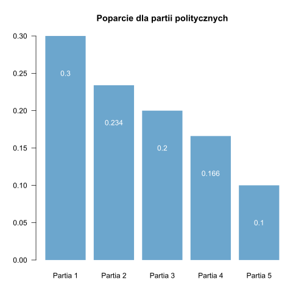
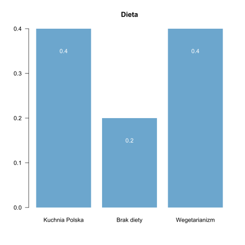
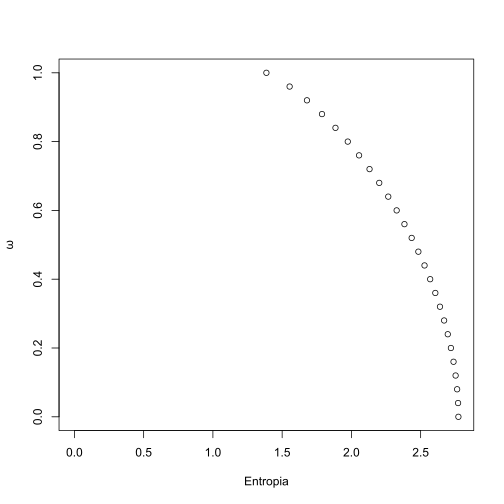
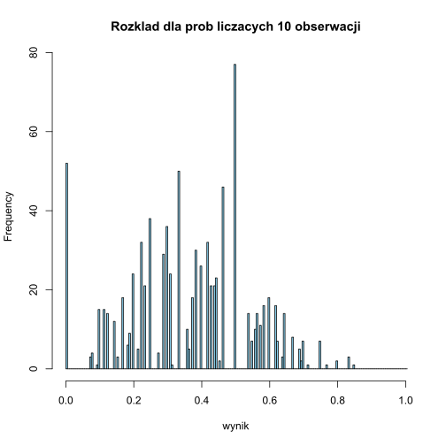
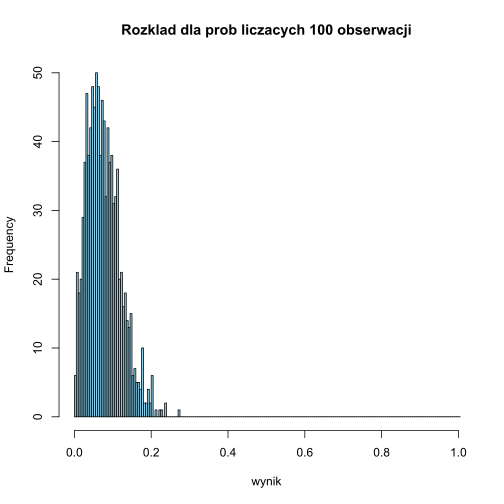
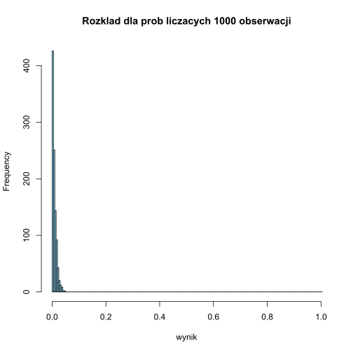

# <center> ZALEŻNOŚĆ STATYSTYCZNA UPORZĄDKOWANIA KATEGORII OD ZMIENNYCH NOMINALNYCH</center>


### Prawa autorskie

Prezentacja jest opisem referatu wygłoszonego przez __prof. Grzegorza Lissowskiego__ we wrześniu 2014 roku na konferencji w Jabłonnie dotyczącego nowej miary zależności statystycznej. Pełen opis nowej miary zależności można znaleźć tutaj: [ZALEŻNOŚĆ STATYSTYCZNA UPORZĄDKOWANIA KATEGORII OD ZMIENNYCH NOMINALNYCH](G_Lissowski_prezentacja.pdf).

# 1. Wstęp i omówienie przykładowego zagadnienia

Wyobraśmy sobie, że realizujemy badanie ankietowe, w którym respondenci mają za zadanie wybrać jedną partię, na którą oddaliby swój głos (gdyby wybory odbywały się w najbliższą niedzielę). Dodatkowo pytamy o to na jakiej są diecie (przypadkowe inne pytanie). W rezultacie otrzymujemy rozkłady dla dwóch zmiennych:


```R
poparcie<-barplot(c(0.3, 0.234, 0.2, 0.166, 0.1),names.arg = c("Partia 1","Partia 2","Partia 3","Partia 4","Partia 5"), las=1, border = "transparent", col="skyblue3", main = "Poparcie dla partii politycznych")
text( poparcie, c(0.3, 0.234, 0.2, 0.166, 0.1 )-0.05, labels = c(0.3, 0.234, 0.2, 0.166, 0.1), col="white")
```





```R
dieta<-barplot(c(0.4, 0.2, 0.4),names.arg = c("Kuchnia Polska","Brak diety","Wegetarianizm"), main="Dieta", las=1, border = "transparent", col="skyblue3")
text( dieta, c(0.4, 0.2, 0.4 )-0.05, labels = c(0.4, 0.2, 0.4), col="white")
```





__Rozkład łączny poparcia dla partii politycznych i diety__


```R
rozklad_laczny<-
    matrix(
        c( 0.12, 0.08, 0.1,
           0.1,  0.05, 0.084,
           0.08, 0.04, 0.08,
           0.06, 0.03, 0.076,
           0.04, 0,    0.06),
        nrow = 5,
        ncol = 3,
        byrow = TRUE
    )
colnames(rozklad_laczny)<-c("Kuchnia Polska","Brak diety","Wegetarianizm")
row.names(rozklad_laczny)<-c("Partia 1","Partia 2","Partia 3","Partia 4","Partia 5")
rozklad_laczny_brzegowy<-addmargins(rozklad_laczny)
colnames(rozklad_laczny_brzegowy)<-c("Kuchnia Polska","Brak diety","Wegetarianizm", "RAZEM")
row.names(rozklad_laczny_brzegowy)<-c("Partia 1","Partia 2","Partia 3","Partia 4","Partia 5", "RAZEM")
rozklad_laczny_brzegowy
```


<table>
<thead><tr><th></th><th scope=col>Kuchnia Polska</th><th scope=col>Brak diety</th><th scope=col>Wegetarianizm</th><th scope=col>RAZEM</th></tr></thead>
<tbody>
	<tr><th scope=row>Partia 1</th><td>0.12</td><td>0.08</td><td>0.10</td><td>0.30</td></tr>
	<tr><th scope=row>Partia 2</th><td>0.100</td><td>0.050</td><td>0.084</td><td>0.234</td></tr>
	<tr><th scope=row>Partia 3</th><td>0.08</td><td>0.04</td><td>0.08</td><td>0.20</td></tr>
	<tr><th scope=row>Partia 4</th><td>0.060</td><td>0.030</td><td>0.076</td><td>0.166</td></tr>
	<tr><th scope=row>Partia 5</th><td>0.04</td><td>0.00</td><td>0.06</td><td>0.10</td></tr>
	<tr><th scope=row>RAZEM</th><td>0.4</td><td>0.2</td><td>0.4</td><td>1.0</td></tr>
</tbody>
</table>


O pierwszej z powyższych zmiennych ("partia") będziemy mówili, że jest to zmienna typu "wybór". Oznacza to, że zamiast badania pełnej preferencji na zbiorze opcji, respondenci musieli wybrać tylko jedną (niekoniecznie najwyżej ocenianą opcję).  W efekcie otrzymaliśmy uporządkowanie opcji wyznaczone przez częstość ich wyboru. "Partia" jest zmienną nominalną, więc nie możemy mówić, że istnieje jakiś inny ustalony porządek jej kategorii. Uporządkowanie wynika tylko i wyłącznie z częstości występowania. Zmienna "dieta" również jest mierzona na skali nominalnej. Przyjmiemy, że jest to cecha respondentów. Nie mamy w tym przypadku doczynienia z preferencjami (każdy może być jednocześnie tylko na jednej diecie).

Skoro mamy dwie zmienne to oczywiście chcielibyśmy jakoś opisać występujące dla nich zależności. __Ale jak badać zależności między zmienną "wybór" (nominalną) i drugą zmienną nominalą?__.  Gdyby chodziło o zmienne porządkowe, skorzystalibyśmy pewnie z miary _tau Kendalla_. Tak jednak nie jest. Co możemy więc zrobić? 

# 2. Wprowadzenie do nowej miary zależności

Prof. Lissowski ma następującą propozycję dotyczącą warunków jakie musi spełniać nowa miara zależności statystycznej. 

## 2.1. Niezależność statystyczna dla nowej miary zależności

"__Niezależność statystyczna__ _zmiennej X (typu „wybór”) od zmiennej Y (nominalnej) polega na tym, że takie same są uporządkowania częstości wyborów kategorii zmiennej X we wszystkich grupach badanych osób, wyróżnionych ze względu na zmienną Y._"

W naszym przykładzie niezależność zmiennych oznaczałaby, że uporządkowanie partii dla każdej diety jest takie samo:

__Kuchnia Polska:__


```R
row.names(rozklad_laczny)[order(rozklad_laczny[,1], decreasing = TRUE)]
```


<ol class=list-inline>
	<li>"Partia 1"</li>
	<li>"Partia 2"</li>
	<li>"Partia 3"</li>
	<li>"Partia 4"</li>
	<li>"Partia 5"</li>
</ol>


__Brak diety:__


```R
row.names(rozklad_laczny)[order(rozklad_laczny[,2], decreasing = TRUE)]
```


<ol class=list-inline>
	<li>"Partia 1"</li>
	<li>"Partia 2"</li>
	<li>"Partia 3"</li>
	<li>"Partia 4"</li>
	<li>"Partia 5"</li>
</ol>


__Wegetarianizm:__


```R
row.names(rozklad_laczny)[order(rozklad_laczny[,3], decreasing = TRUE)]
```


<ol class=list-inline>
	<li>"Partia 1"</li>
	<li>"Partia 2"</li>
	<li>"Partia 3"</li>
	<li>"Partia 4"</li>
	<li>"Partia 5"</li>
</ol>


I to się zgadza. We wszystkich przypadkach uporządkowanie partii ze względu na częstość występowania jest takie samo. Formalny zapis definicja niezależności wygląda następująco:

__Definicja 1. o niezależności statystycznej__

Zmienna X jest __niezależna statystycznie__ w powyższym sensie od zmiennej Y wtedy, gdy

$\forall y_g \in Y , \forall x_i , x_k \in X:$

$P(X=x_i | Y = y_g) < P(X=x_k | Y = y_g) \Leftrightarrow P(X=x_i) < P(X=x_k)$

$P(X=x_i | Y = y_g) = P(X=x_k | Y = y_g) \Leftrightarrow P(X=x_i) = P(X=x_k)$

$P(X=x_i | Y = y_g) > P(X=x_k | Y = y_g) \Leftrightarrow P(X=x_i) > P(X=x_k)$

## 2.2. Maksymalna zależność statystyczna dla nowej miary zależności

Analogicznie możemy mówić o maksymalne zależności statystycznej:

__"Maksymalna zależność statystyczna__ _zmiennej X (typu „wybór”) od zmiennej Y (nominalnej) oznacza (jak zawsze), że wszystkie osoby w każdej z wyróżnionych grup ze względu na zmienną Y wybierają tę samą kategorię zmiennej X"_.

W praktyce powyższt warunek może spełnić następujący rozkład naszych zmiennych:

__Rozkład łączny częstości X i Y__

Partia    | Kuchnia Polska | Brak diety  | Wegetarianizm | RAZEM
--------- | -------------  | ----------- | ------------- | ------
Partia 1  |	0,2            | 0           | 0             | 0,2
Partia 2  |	0              | 0,3         | 0             | 0,3
Partia 3  |	0              | 0           | 0,5           | 0,5
Partia 4  |	0              | 0           | 0             | 0
Partia 5  |	0              | 0           | 0             | 0
RAZEM     |	0,2            | 0,3         | 0,5           | 1

__Rozkład warunkowy częstości X | Y__

Partia    | Kuchnia Polska | Brak diety  | Wegetarianizm
--------- | -------------  | ----------- | -------------
Partia 1  |	1              | 0           | 0
Partia 2  |	0              | 1           | 0
Partia 3  |	0              | 0           | 1
Partia 4  |	0              | 0           | 0
Partia 5  |	0              | 0           | 0
RAZEM     |	1              | 1           | 1

__Definicja 2. o maksymalnej zależności statystycznej__

$\forall y_g \in Y , \exists x_i \in X: P(X=x_i | Y = y_g)=1$

Dla naszego przykładu oznaczałoby to, że w przypadku wszystkich diet wybrano jedną i tą samą partię.

To tyle wprowadzenia. Wydaje mi się, że pomysł jest bardzo prosty. Zobaczymy jak będzie z wykonaniem.

# 3. Nowa miara zależności w praktyce

Powyższe warunki dotyczące niezależności oraz maksymalnej zależności między zmienną X typu "wybór", a inną nominalną zmienną Y spełnia miara, która ma następującą postać:

$$\omega_{X|Y} =   \frac{ \sum_{i=1}^n r_i P(X=x_i)   -  \sum_{g=1}^G P(Y=y_g)   \sum_{i=1}^n r_{ig}P(X=x_i|y=y_g) }{ \sum_{i=1}^n r_i P(X=x_i) - 1} $$

gdzie: 

 * $r_i$ ranga częstości kategorii $x_i$ w uporządkowaniu nierosnącym w całej zbiorowości,
 * $r_{ig}$ ranga warunkowej częstości kategorii $x_i$ w uporządkowaniu nierosnącym w podzbiorowości {$Y=y_g$}.

Najistotniejsze w powyższym wzorze jest to, że nie wykorzystuje on wartości mierzonych zminnych (czyli wartości nominalnych). To bardzo ważne! Na tym polega cała sztuczka tej miary, że ucieka o wartości i korzysta wyłącznie z rang oraz częstości występowania kategorii. To bardzo dobry pomysł.

Ale skąd taki wzór i jak to się dzieje, że spełnia on wsztstkie wspomniane wcześniej warunki nowej miary? Kluczami do odpowiedzi na te pytania są "klasyczne" miar rozproszenia i koncentracji: __MD__ oraz __MDA__. To właśnie na podstawie tych dwóch koncepcji opracowana została nowa miara zaleźności statystycznej $\omega$. Warto więc przyjrzeć im się bliżej.

## 3.1. Miary MD i MDA

Miary MD oraz MDA opisują odpowiednio stopień roproszenia i koncentracji zmiennej. Za ich pomocą można w prosty sposób wyjaśnić czym jest nowa miara zależności $\omega$.

###  3.1.1. MD czyli średnia różnica (mean difference) - miara rozproszenia

MD - średnia różnica (mean difference) - została zaproponowana przez słynnego Corrado Gini w 1912 r. jako miara rozproszenia. Zapisuje się ją jako:
 
$$MD(X)=\frac{1}{n(n-1)} \sum_{i=1}^n \sum_{k=1}^n |x_i-x_k|$$

Jak widać jest to średnia wartość różnic między wszystkimi możliwymi parami wartości X. Pierwotnie Corrado Gini zakładał, że zmienna X jest mierzona na skali ilorazowej. To źle, bo nasze zmienne są mierzone na skali nominalnej. Dlatego zrobimmy małą sztuczkę i do obliczeń zamiast wartości zmiennej użyjemy czestości jej występowania czyli $P(X=x_i)$ lub prościej $p_i$. Uciekamy w ten sposób od wartości nominalnych zmiennej: 

$$MD(X)=\frac{1}{n(n-1)} \sum_{i=1}^n \sum_{k=1}^n |p_i-p_k|$$

Ładnie, ale co właściwie z tego wynika? Jaka jest wartość minimalna i maksymalna tej miary? Do czego możemy ją wykorzystać? Żeby odpowiedzieć na te pytania trzeba się trochę pobawić z __MD__. Spróbować ją przekształcić i wyznaczyć na nowo. 

Zacznijmy od sumy różnic, która znajduje się w powyższym równaniu. Oznaczmy ją jako $\Delta$:

$$\Delta=\sum_{i=1}^n \sum_{k=1}^n |p_i-p_k|$$

Przypomnijmy sobie, że nasza zależności wymaga, aby kategorie zmiennej X były uporządkowane względem częstośći występowanie. Niech więc $p_1 \geq p_2 \geq p_3 \geq ... \geq p_{n-1} \geq p_n$

Mając tak uporządkowane $P_i$ możemy zapisać wartości bezwzględne różnic między wszystkimi parami częstości, czyli $\Delta$, w postaci macierzowej. Ułatwi nam to przekształcenie $\Delta$ do innej postaci. Macierz, w której zapiszemy bezwzględne wartości różnic nazwiemy __D__. Będzie miała ona wymiar $n \times n$, bo wyznaczamy różnicę między wszystkimi wartościam $P_i$, których jest _n_.


$$D=\begin{bmatrix} 
  |p_1-p_1| & |p_1-p_2| & |p_1-p_3| & \cdots & |p_1-p_n|  \\ 
  |p_2-p_1| & |p_2-p_2| & |p_2-p_3| & \cdots & |p_2-p_n|  \\ 
  \cdots    & \cdots    & \cdots    & \cdots & \cdots \\
  \cdots    & \cdots    & \cdots    & \cdots & \cdots \\
  |p_n-p_1| & |p_n-p_2| & |p_n-p_3| & \cdots & |p_n-p_n|  \\ 
 \end{bmatrix}$$

Po chwili zastanowienia możemy uprościć macierz do następującej postaci (wartości na przekątnej się zerują): 

 $$D=\begin{bmatrix} 
  0 & |p_1-p_2| & |p_1-p_3| & \cdots & |p_1-p_n|  \\ 
  |p_1-p_2| & 0 & |p_2-p_3| & \cdots & |p_2-p_n|  \\ 
  \cdots    & \cdots    & \cdots    & \cdots & \cdots \\
  \cdots    & \cdots    & \cdots    & \cdots & \cdots \\
  |p_n-p_1| & |p_n-p_2| & |p_n-p_3| & \cdots & 0  \\ 
 \end{bmatrix}$$

 
Ale to nie wszystko. Zauważmy, że $|p_1-p_2|$ jest równe co do wartości $|p_2-p_1|$ ! Możemy więc zmodyfikować naszą macierz podstawiając pod $|p_2-p_1|$ wartość $|p_1-p_2|$. Jeśli podobną operację przeprowadzimy dla wszystkich wartości pod przekątną to otrzymamy macierz symetryczną (wartości pod przekątną są odbiciem lustrznym wartości nad przekątną):

$$D=\begin{bmatrix} 
  0 & |p_1-p_2| & |p_1-p_3| & \cdots & |p_1-p_n|  \\ 
  |p_1-p_2| & 0 & |p_2-p_3| & \cdots & |p_2-p_n|  \\ 
  \cdots    & \cdots    & \cdots    & \cdots & \cdots \\
  \cdots    & \cdots    & \cdots    & \cdots & \cdots \\
  |p_1-p_n| & |p_2-p_n| & |p_3-p_n| & \cdots & 0  \\ 
 \end{bmatrix}$$

A teraz przypomnijmy sobie, że $p_1 \geq p_2 \geq p_3 \geq ... \geq p_{n-1} \geq p_n$. Czyli $p_1-p_2$ będzie nieujemne. Możemy więc pozbyć się wartości bezwzględnych i zostawić samo $(p_1-p_2)$:

$$D=\begin{bmatrix} 
  0 & (p_1-p_2) & (p_1-p_3) & \cdots & (p_1-p_n)  \\ 
  (p_1-p_2) & 0 & (p_2-p_3) & \cdots & (p_2-p_n)  \\ 
  \cdots    & \cdots    & \cdots    & \cdots & \cdots \\
  \cdots    & \cdots    & \cdots    & \cdots & \cdots \\
  (p_1-p_n) & (p_2-p_n) & (p_3-p_n) & \cdots & 0  \\ 
 \end{bmatrix}$$

Wiemy, że $\Delta$ to suma po wszystkich elementach macierzy __D__. Jeżeli przyjrzymy się  uważnie __D__ to zauważymy, że sumę po jej wszystkich elementach ($\Delta$) można zapisać jako: 

$$\Delta   = (p_1-p_2)+(p_1-p_3)+ \dots + (p_1-p_2) \dots + (p_{n-1}-p_n)$$

$$\Delta   = p_1-p_2+p_1-p_3+ \dots + p_1-p_2 \dots + p_{n-1}-p_n$$

Teraz możemy uwzględnić to, że macierz jest symetryczna. W związku z tym, nad przekątną i pod przekątną suma elementów wygląda następującą:

$$(n-1)p_1+(n-2)p_2+ \dots -p_2 - 2p_3 - \dots - (n-1)p_n$$

co można zapisać jako: 

$$\sum_{i=1}^n (n-i)p_i - \sum_{k=1}^n (i-1)p_i $$

Ponieważ powtarza się to dwukrotnie, nad i pod przekątną, więc wartość $\Delta$ możemy zapisać jako:

$$\Delta   = 2\sum_{i=1}^n (n-i)p_i - 2 \sum_{k=1}^n (i-1)p_i $$

co można dalej przekształcać w następujący sposób:
 
$$\Delta =  2\sum_{i=1}^n (n-2i+1)p_i $$
$$\Delta =  2\sum_{i=1}^n (n+1)p_i-2ip_i $$
 
$$\Delta =   2 \sum_{i=1}^n (n+1)p_i - 4 \sum_{i=1}^n ip_i $$

$$\Delta =  2(n+1) \sum_{i=1}^n p_i - 4 \sum_{i=1}^n ip_i $$

aż otrzymujemy:
 
$$\Delta =  2(n+1)- 4 \sum_{i=1}^n ip_i$$

A teraz najważniejsze!!! __Zauważmy, że__: 

 * jeżeli rozkład zmiennej X jest równomierny, tj. wszystkie częstości są równe $p_1 = p_2 = p_3 = ... = p_{n-1} = p_n = \frac{1}{n}$, to $\Delta=0$
 * jeżeli rozkład zmiennej X jest jednopunktowy, tj. występuje w nim skrajna koncentracja,$p_1 = 1, p_2 = p_3 = ... = p_{n-1} = p_n = 0$, to $\Delta=2(n-1)$

Teraz wróćmy do miary MD podstawiają do niej wyznaczoną wartość $\Delta$: 

$$MD(P)=\frac{\Delta}{n(n-1)}  = \frac{2(n+1)- 4 \sum_{i=1}^n ip_i}{n(n-1)} $$.  

Znając własności $\Delta$ możemy powiedzieć, że miara MD w wypadku skrajnej koncentracji jest równa 2/n, gdyż: 

$$MD_{max} = \frac{\Delta_{max}}{n(n-1)} = \frac{2(n-1)}{n(n-1)}= \frac{2}{n}$$

Wolelibyśmy, aby miara MD w przypadku skrajnej koncentracji przyjmowała wartość 1. To dawałoby nam miarę, która przyjmuje wartości od 0 do 1. Żeby tak było usimy unormować MD (podzielić przez maksymalną wartość): 

$$MD_{unorm.}(X)=\frac{\frac{ 2(n+1)- 4 \sum_{i=1}^n ip_i}{n(n-1)}}{ \frac{2}{n} }$$

To niezbyt eleganckie wyrażenie skraca się do prostego: 

$$MD_{unorm.}=\frac{ n+1- 2 \sum_{i=1}^n ip_i}{n-1}$$

Gotowe!!! __Teraz miara MD wyznaczona dla częstości zmiennej nominalnej przyjmuje wartości od 0 do 1__:

 * wartość 0 – w wypadku rozkładu równomiernego
 * wartość 1 – w wypadku rozkładu, w którym jedna z kategorii występuje z częstością 1
 * miara ta jest równa skorygowanej mierze koncentracji (Ray i Singer 1973).
 
Jesteśmy w połowie drogi do nowej miary zależności statystycznej $\omega$. Teraz będzie z górki. Zapnijcie pasy.

### 3.1.2. MDA  czyli analog średniej różnicy (mean difference analog) - miara koncentracji

Z punktu widzenia opisu badanego rozkładu częstości bardziej przydatna niż miara koncentracji (czyli MD) będzie miara różnorodności, dla której:

 * wartość 0 będzie oznaczać, że jedna z kategorii występuje z częstością 1; 
 * wartość 1 będzie oznaczać rozkład równomierny.
 
Czyli dokładnie odwrotnie niż MD. Zależy nam na tym, aby większa wartość miary oznaczała bardziej zróżnicowany rozkład. Logiczne. Tego rodzaju własność posiada miara MDA (_mean difference analog_) analizowana przez Allena R. Wilcoxa (1973). W naszym przypadku (wykorzystujemy częstości a nie wartości kategorii zmiennej) przyjmuje ona następującą postać:

$$MDA = 1 - \frac{\sum_{i=1}^{n-1} \sum_{k=i+1}^{n} |p_i - p_k|}{n-1} $$

Czy to znaczy, że cały wysiłek związany z wyznaczaniem miary MD pójdzie na marne, bo ma ona odwrotne unormowanie niż chcemy. Oczywiście, że nie. Miarę __MDA__ otrzymujemy bowiem bezpośrenio poprzez proste przekształcenie (odwrócenie unormowania) miary MD:

$$1-MD_{unorm.}$$

czyli:

$$MDA =1 - \frac{n+1-2\sum_{i=1}^n ip_i}{n-1} $$

To brzmi sensownie, że chcąc uzyskać miarę o odwrotnym unormowaniu odwracamy miarę odwrotnie unormowaną... Ale na wszelki wypadek sprawdźmy powiązanie między __MDA__ i __MD__. Czy rzeczywiście:

$$MDA = 1 - \frac{\sum_{i=1}^{n-1} \sum_{k=i+1}^{n} |p_i - p_k|}{n-1}   \stackrel{?}{=}1 - \frac{n+1-2\sum_{i=1}^n ip_i}{n-1}=1-MD_{unorm.}$$ 

Widać, że całe porównanie będzie polegało na sprawdzeniu czy $\sum_{i=1}^{n-1} \sum_{k=i+1}^{n} |p_i - p_k|$ jest równe naszemu $\Delta$, czyli $n+1-2\sum_{i=1}^n ip_i$. Zobaczmy:

$$ \Delta = n+1-2\sum_{i=1}^n ip_i$$
$$\Delta =(n+1)-2\sum_{i=1}^n ip_i$$
$$\Delta =(n+1)\sum_{i=1}^n p_i-2\sum_{i=1}^n ip_i$$
$$\Delta = \sum_{i=1}^n(n+1)p_i-2 ip_i$$
$$\Delta = \sum_{i=1}^n np_i+p_i-ip_i-ip_i$$
$$\Delta = \sum_{i=1}^n np_i-ip_i-ip_i+p_i$$
$$\Delta =\sum_{i=1}^n (n-i)p_i-(i-1)p_i$$

jeśli powyższą sumę to otrzymamy:

$$ (p_1-p_2)+(p_1-p_3)+...+(p_1-p_n)+(p_2-p_3)+(p_2-p_4)+...+(p_2-p_n)+...+(p_{n-1}-p_n)$$

co (pamiętając o założeniu $p_1 \geq p_2 \geq p_3 \geq ... \geq p_{n-1} \geq p_n$) możemy zapisać jako:

$$\sum_{n-1}^{i=1} \sum_{n}^{k=i+1} (p_i - p_k) = \sum_{n-1}^{i=1} \sum_{n}^{k=i+1} |p_i - p_k|$$

Niespodzianka! Czyli rzeczywiście:

$$MDA =  1 - \frac{\sum_{n-1}^{i=1} \sum_{n}^{k=i+1} |p_i - p_k|}{n-1}   =  1 - \frac{n+1-2\sum_{i=1}^n ip_i}{n-1}  =   1-MD(P) $$

Możemy śmiało powiedzieć, że __MDA__ otrzymujemy po odwróceniu unormowania miary __MD__. Skoro tak to skorzystajmy z tej własności i zapiszmy __MDA__ w uproszczonej formie jako: 

$$MDA = 1 - \frac{n+1-2\sum_{i=1}^n ip_i}{n-1} = \frac{2(\sum_{i=1}^n ip_i -1  )}{n-1} $$

## 3.2. Nowa miara zależności statystycznej

Nowa miara zależności zmiennej X typu "wybór" od zmiennej nominalnej Y będzie oznaczana jako $\omega_{X|Y}$  i przyjmie następując postać:

$$\omega_{X|Y}=\frac{MDA(X)-E(MDA(X|Y))}{MDA(X)}$$

Jak widać nowa miara zależności statystycznej intensyenie wykorzystuje miarę __MDA__. To po prostu różnica między wartością MDA dla rozkładu zmiennej X, a średnią wartością MDA dla rozkładu zmiennej X ze wszystkich kategorii zmiennej Y, podzielona dodatkowo przez wartość MDA dla rozkładu zmiennej X. Proste.

### 3.2.1. Ostateczna postać nowej miary zależności statystycznej

Żeby opisać czym jest __E(MDA(X|Y))__ potrzebna będzie mała zmiana oznaczeń. W równaniu MDA parametr _i_ (równy numerom obserwacji) będziemy teraz nazywać rangą. Przypomnijmy, że kategorie X są uporządkowane nierosnąco względem częstości występowania. Dla pierwszej, najczęściej występującej kategorii, i=1 dla następnej i=2 itd. Zatem parametr _i_ jest rangą. Teraz zmienimy jego oznaczenie i wprowadzimy dodatkowe wartości:

 * $r_i$ ranga częstości kategorii $x_i$ w uporządkowaniu nierosnącym w całej zbiorowości,
 * $r_{ig}$ ranga warunkowej częstości kategorii $x_i$ w uporządkowaniu nierosnącym w podzbiorowości {$Y=y_g$}.

Możemy teraz zapisać, że:

$$MDA(X) = \frac{2( \sum_{i=1}^n r_i P(X=x_i) -1) }{n-1}$$

$$MDA(X|Y=y_g) = \frac{2( \sum_{i=1}^n r_{ig}P(X=x_i|y=y_g) -1) }{n-1}$$

Czyli nowa miara zależności statystycznej przybiera (niewyraźną) postać: 

$$\omega_{X|Y} =  \frac{  \frac{2( \sum_{i=1}^n r_i P(X=x_i) -1) }{n-1} -  \sum_{g=1}^G P(Y=y_g)  \frac{2( \sum_{i=1}^n r_{ig}P(X=x_i|y=y_g) -1) }{n-1} }{ \frac{2( \sum_{i=1}^n r_i P(X=x_i) -1) }{n-1}  } $$

którą na szczęście możemy uprościć do __ostatecznej postaci__:

$$\omega_{X|Y} =   \frac{ \sum_{i=1}^n r_i P(X=x_i)   -  \sum_{g=1}^G P(Y=y_g)   \sum_{i=1}^n r_{ig}P(X=x_i|y=y_g) }{ \sum_{i=1}^n r_i P(X=x_i) - 1} $$


Mamy to co chcieliśmy. Czas omówić właności nowej miary zależności:  

"_Miara zależności przyjmuje wartość 0, gdy zmienna X jest niezależna statystycznie od zmiennej Y w sensie __Definicji 1__ oraz wartość 1, gdy jest maksymalnie zależna statystycznie_".

### 3.2.2. Twierdzenia o nowej miary zależności statystycznej

__Twierdzenie 1. o niezależności statystycznej ($\omega_{X|Y}$ = 0)__

_Jeżeli zmienna X jest niezależna statystycznie od zmiennej Y w sensie __Definicji 1__, to $\omega_{X|Y}$ = 0_.

Dowód:

$$\omega_{X|Y} =   \frac{ \sum_{i=1}^n r_i P(X=x_i)   -  \sum_{g=1}^G P(Y=y_g)   \sum_{i=1}^n r_{ig}P(X=x_i|y=y_g) }{ \sum_{i=1}^n r_i P(X=x_i)-1}$$

Skoro zmienna X jest niezależna statystycznie od zmiennej Y to wszystkie rangi warunkowe $r_{ig}$ będą równe odpowiednim rangom $r_i$, bo uporządkowanie kategorii zmiennej X w rozkładach warunkowych będzie takie samo jak uporządkowanie kategorii samej zmiennej X. Formalnie zapisujemy to jako $y_g \in Y: r_{ig}=r_i$. To pozwala nam uprościć odjemnik w liczniku powyższego wyrażenia.

Odejminik:
$$\sum_{g=1}^G P(Y=y_g)   \sum_{i=1}^n r_{ig}P(X=x_i|y=y_g)$$
Zamiana $r_{ig}$ na $r_i$:
$$ \sum_{g=1}^G P(Y=y_g)   \sum_{i=1}^n r_{i}P(X=x_i|y=y_g)$$
Włączenie pod sumę po __i__ prawdopodobieństwa $P(Y=y_g)$: 
$$ \sum_{g=1}^G    \sum_{i=1}^n P(Y=y_g) r_{i} P(X=x_i|y=y_g)$$
Zamiania rozkładu warunkowego na łączny:
$$ \sum_{g=1}^G    \sum_{i=1}^n r_{i} P(X=x_i \land  y=y_g) $$
Zamiania kolejności sumowania:
$$    \sum_{i=1}^n \sum_{g=1}^G  r_{i} P(X=x_i \land  y=y_g) $$
Wyłączanie rangi $r_i$ przed sumę po _g_:
$$   \sum_{i=1}^n r_{i} \sum_{g=1}^G P(X=x_i \land  y=y_g) $$
Suma częstości z rozkładu łączengo dla wybranej kategorii zmiennej X po wszystkich kategoriach Y daje rozkład brzegowy X więc możemy napisać:
$$ \sum_{i=1}^n r_i P(X=x_i)$$

Przekształcony odejmnik podstawiamy do równania na $\omega_{X|Y}$, które zgodnie z tym co przewidywaliśmy będzie dawało w wyniku 0:
$$\omega_{X|Y} =   \frac{ \sum_{i=1}^n r_i P(X=x_i) - \sum_{i=1}^n r_i P(X=x_i) }{ \sum_{i=1}^n r_i P(X=x_i) - 1} = 0 $$

__Twierdzenie 2. o innych przypadkach gdy $\omega_{X|Y}$ = 0__

_Jeżeli dla każdej kategorii $x_i$ zmiennej X zachodzi równość między rangą tej kategorii w całej zbiorowości a średnią rang tej kategorii w podzbiorowościach wyróżnionych ze względu na zmienną Y, to miara zależności przyjmuje wartość 0_.

Dowód.

Licznik miary zależności w zapisie uproszczonym ma następującą postać.

$$\sum_{i=1}^n r_i P(X=x_i) - \sum_{g=1}^G P(Y=y_g) \sum_{i=1}^n r_{ig}P(X=x_i|y=y_g)=$$
$$=\sum_{i=1}^n r_i P(X=x_i) - \sum_{i=1}^n \sum_{g=1}^G  r_{ig} P(X=x_i \land  y=y_g)=$$
$$=\sum_{i=1}^n r_i P(X=x_i) -  \sum_{i=1}^n \sum_{g=1}^G P(Y=x_i) r_{ig}P(X=x_i|y=y_g)=$$
$$=\sum_{i=1}^n r_i P(X=x_i) -  \sum_{i=1}^n \sum_{g=1}^G P(Y=x_i) r_{ig}P(X=x_i|y=y_g)=$$
$$=\sum_{i=1}^n P(X=x_i)[ r_i -  \sum_{g=1}^G r_{ig} P(X=x_i|y=y_g)]$$

Wyrażenie w nawiasie kwadratowym jest różnicą między rangą kategorii $x_i$ w całej zbiorowości a średnią rang tej kategorii w podzbiorowościach wyróżnionych ze względu na zmienną Y. Jeżeli dla każdej kategorii $x_i \in X$ jest
ono równe 0, to $ \omega_{X|Y} = 0$.

Czyli istnieją dwie sytuacje, w których miara $\omega_{X|Y}$ przyjmuje wartość 0, z czego jedną jest niezależność statystyczna. Przykładem rozkłądu, który spełnia powyższe kryteria jest rozkład równomierny.

__Twierdzenie 3. o maksymalnej zależności statystycznej ($\omega_{X|Y}$ = 1)__

_Nowa miary zależności przyjmuje wartość 1, gdy zmienna X jest maksymalnie zależna statystycznie od zmiennej Y w sensie __Definicji 2___. 

Wystarczy zauważyć, że w tym wypadku wartość E[MDA(X|Y)] musi być równa 0. Tak może być jedynie wtedy, gdy każdy warunkowy rozkład zmiennej X ze względu na zmienną Y jest zerojedynkowy i w konsekwencji dla każdego $y_g \in Y: MDA(X|Y=y_g)=0$.

Dowód: 

Przypomnijmy, że zgodnie z __Definicją 2__ maksymalna zależność statystyczna zmiennej X od Y oznacza, że dla każdej kategorii Y tylko jedna kategoria X ma częstość niezerową (czyli tylko jedna kategoria jest wybierana, ale dla każdego Y to może być inna kategria).

To oznacza, że dla _g-tej_ kategorii Y:

$$\sum_{i=1}^n r_{ig}P(X=x_i|y=y_g)=1$$

bo maksymalna zależność powoduje, że dla _g-tej_ kategorii w powyższej sumie pierwsze prawdopodobieństwo przyjmie wartość 1, a pozostałe 0 więc otrzymamy:

$$1\cdot 1 + 2 \cdot 0 + 3 \cdot 0 + ... n \cdot 0 = 1$$

Możemy więc podstawić do wzoru zamiast sumy 1:

$$\omega_{X|Y} = \frac{ \sum_{i=1}^n r_i P(X=x_i) - \sum_{g=1}^G P(Y=y_g) \cdot 1 }{ \sum_{i=1}^n r_i P(X=x_i)-1}$$

oczywiście możemy pominąć 1 i wtedy zostaje: 

$$\omega_{X|Y} = \frac{ \sum_{i=1}^n r_i P(X=x_i) - \sum_{g=1}^G P(Y=y_g) }{ \sum_{i=1}^n r_i P(X=x_i)-1}$$

skoro tak, to zauważmy, że $\sum_{g=1}^G P(Y=y_g)=1$, a to daje nam:

$$\omega_{X|Y} = \frac{ \sum_{i=1}^n r_i P(X=x_i) - 1 }{ \sum_{i=1}^n r_i P(X=x_i)-1} = 1$$

Czyli udowodniliśmy, że maksymalna zależność zmiennych X i Y skutkuje przyjęciem przez miarę $\omega_{X|Y}$ wartości 1.

# 4. Przykłady działania nowej miary

Przejdźmy do praktycznych przykładów, które mam nadzieję wyjaśnią wszystkie niejasności związane z działaniem nowej miary zależność $\omega_{X|Y}$.

## 4.1 Przypomnienie nowej miary

Zacznijmy od szybkiego przypomnienia, że zajmujemy się zależnością statystyczną między zmiennej X (typu „wybór” - nominalnej) od zmiennej Y (nominalnej). Dla tego typu zmiennych zdefiniowaliśmy, że:    

 * __Niezależność statystyczna__ zmiennej X (typu „wybór”) od zmiennej Y (nominalnej) polega na tym, że takie same są uporządkowania częstości wyborów kategorii zmiennej X we wszystkich grupach badanych osób, wyróżnionych ze względu na zmienną Y.
 * __Maksymalna zależność statystyczna__ zmiennej X (typu „wybór”) od zmiennej Y (nominalnej) oznacza (jak zawsze), że wszystkie osoby w każdej z wyróżnionych grup ze względu na zmienną Y wybierają tę samą kategorię zmiennej X.

Nowa miara zależności statystycznej ma postać:

$$\omega_{X|Y} =   \frac{ \sum_{i=1}^n r_i P(X=x_i)   -  \sum_{g=1}^G P(Y=y_g)   \sum_{i=1}^n r_{ig}P(X=x_i|y=y_g) }{ \sum_{i=1}^n r_i P(X=x_i)-1}$$

gdzie: 

 * $r_i$ ranga częstości kategorii $x_i$ w uporządkowaniu nierosnącym w całej zbiorowości,
 * $r_{ig}$ ranga warunkowej częstości kategorii $x_i$ w uporządkowaniu nierosnącym w podzbiorowości {$Y=y_g$}.

__Miara zależności__ przyjmuje wartość __0, gdy zmienna X jest niezależna__ statystycznie od zmiennej Y  oraz wartość __1, gdy jest maksymalnie zależna__ statystycznie. 

## 4.2 Przykład niezależności zmiennej X od Y dla nowej miary zależności

Za przykład przyjmijmy przytoczony na samym początku rozkład częstości zmiennych "partia" i "dieta":


```R
niezaleznosc<-matrix(
    c(0.12, 0.08, 0.1,
      0.1,  0.05, 0.084,
      0.08, 0.04, 0.08,
      0.06, 0.03, 0.076,
      0.04, 0,    0.06
    ),    nrow = 5,    ncol = 3,    byrow = TRUE
)
niezaleznosc_brzegowy<-addmargins(niezaleznosc)
colnames(niezaleznosc_brzegowy)<-c("Kuchnia Polska", "Brak diety", "Wegetarianizm", "RAZEM")
rownames(niezaleznosc_brzegowy)<-c("Partia 1", "Partia 2", "Partia 3", "Partia 4", "Partia 5", "RAZEM")
niezaleznosc_brzegowy
```


<table>
<thead><tr><th></th><th scope=col>Kuchnia Polska</th><th scope=col>Brak diety</th><th scope=col>Wegetarianizm</th><th scope=col>RAZEM</th></tr></thead>
<tbody>
	<tr><th scope=row>Partia 1</th><td>0.12</td><td>0.08</td><td>0.10</td><td>0.30</td></tr>
	<tr><th scope=row>Partia 2</th><td>0.100</td><td>0.050</td><td>0.084</td><td>0.234</td></tr>
	<tr><th scope=row>Partia 3</th><td>0.08</td><td>0.04</td><td>0.08</td><td>0.20</td></tr>
	<tr><th scope=row>Partia 4</th><td>0.060</td><td>0.030</td><td>0.076</td><td>0.166</td></tr>
	<tr><th scope=row>Partia 5</th><td>0.04</td><td>0.00</td><td>0.06</td><td>0.10</td></tr>
	<tr><th scope=row>RAZEM</th><td>0.4</td><td>0.2</td><td>0.4</td><td>1.0</td></tr>
</tbody>
</table>


Zatem rozkład warunkowy częstości X|Y ma następującą postać:


```R
niezaleznosc_y<-addmargins( prop.table(niezaleznosc,2),1) 
colnames(niezaleznosc_y)<-c("Kuchnia Polska", "Brak diety", "Wegetarianizm")
rownames(niezaleznosc_y)<-c("Partia 1", "Partia 2", "Partia 3", "Partia 4", "Partia 5", "RAZEM")
niezaleznosc_y
```


<table>
<thead><tr><th></th><th scope=col>Kuchnia Polska</th><th scope=col>Brak diety</th><th scope=col>Wegetarianizm</th></tr></thead>
<tbody>
	<tr><th scope=row>Partia 1</th><td>0.30</td><td>0.40</td><td>0.25</td></tr>
	<tr><th scope=row>Partia 2</th><td>0.25</td><td>0.25</td><td>0.21</td></tr>
	<tr><th scope=row>Partia 3</th><td>0.2</td><td>0.2</td><td>0.2</td></tr>
	<tr><th scope=row>Partia 4</th><td>0.15</td><td>0.15</td><td>0.19</td></tr>
	<tr><th scope=row>Partia 5</th><td>0.10</td><td>0.00</td><td>0.15</td></tr>
	<tr><th scope=row>RAZEM</th><td>1</td><td>1</td><td>1</td></tr>
</tbody>
</table>


Od razu możemy zauważyć, że zmienne są niezależne w sensie rachnku prawdopodobieństwa (prawdopodobieństwa w rozkładzie łącznym to iloczyny wartości brzegowych), a po drugie że warunkowe uporządowakowanie kategorii zmiennej X jest dla wszystkich kategorii Y jest takie samo.  


```R
# Uporzadkowanie kategorii X dla pierwszej, drugiej i trzeciej katogorii zmiennej Y
# W tabeli numery zmienne X zostały posortowane od największej do najmniejszej częstości
apply( prop.table(niezaleznosc,2), MARGIN = 2, order, decreasing = TRUE )
```


<table>
<tbody>
	<tr><td>1</td><td>1</td><td>1</td></tr>
	<tr><td>2</td><td>2</td><td>2</td></tr>
	<tr><td>3</td><td>3</td><td>3</td></tr>
	<tr><td>4</td><td>4</td><td>4</td></tr>
	<tr><td>5</td><td>5</td><td>5</td></tr>
</tbody>
</table>


Oznacza to, że w myśl wcześniej prezentowanej definicji, zmienna X jest niezależna statystycznie od zmiennej Y.

Teraz możemy się zastanowić nad tym jak, w tej sytuacji zachowa się nowa miara zależności: 

$$\omega_{X|Y} =   \frac{ \sum_{i=1}^n r_i P(X=x_i)   -  \sum_{g=1}^G P(Y=y_g)   \sum_{i=1}^n r_{ig}P(X=x_i|y=y_g) }{ \sum_{i=1}^n r_i P(X=x_i)-1}$$

Zacznijmy od wyznaczenia najprostrzego elementu tej miary czyli $\sum_{i=1}^n r_i P(X=x_i)$ (korzystamy z rozkładu brzegowego zmiennej X i rang przypisanych częstościom):

$$\sum_{i=1}^n r_i P(X=x_i) = 1 \cdot 0.3 + 2 \cdot 0.234 + 3 \cdot 0.2 + 4 \cdot 0.166 + 5 \cdot 0.1 = 2.532
$$

Teraz zajmijmy się odejmnikiem $\sum_{g=1}^G P(Y=y_g) \sum_{i=1}^n r_{ig}P(X=x_i|y=y_g)$. Zauważmy, że wyrażenie przypomina średnią: dla każdej kategorii zmiennej Y wyznaczamy pewną wartość ze względu na warunkowe częstości zmiennej X, a potem mnożymy ją przez częstość kategorii Y. 

Aby wyznaczyć odejmnik potrzebny będzie rozkład warunkowy częstości X|Y:


```R
niezaleznosc_y
```


<table>
<thead><tr><th></th><th scope=col>Kuchnia Polska</th><th scope=col>Brak diety</th><th scope=col>Wegetarianizm</th></tr></thead>
<tbody>
	<tr><th scope=row>Partia 1</th><td>0.30</td><td>0.40</td><td>0.25</td></tr>
	<tr><th scope=row>Partia 2</th><td>0.25</td><td>0.25</td><td>0.21</td></tr>
	<tr><th scope=row>Partia 3</th><td>0.2</td><td>0.2</td><td>0.2</td></tr>
	<tr><th scope=row>Partia 4</th><td>0.15</td><td>0.15</td><td>0.19</td></tr>
	<tr><th scope=row>Partia 5</th><td>0.10</td><td>0.00</td><td>0.15</td></tr>
	<tr><th scope=row>RAZEM</th><td>1</td><td>1</td><td>1</td></tr>
</tbody>
</table>


oraz odpawiadające mu rangi kategorii zmiennej X:


```R
apply( prop.table(niezaleznosc,2), MARGIN = 2, 
      function(x) {
          kolej<-order(x,decreasing = TRUE)
          ranga<-(1:length(kolej))[ order(kolej)]
          return(ranga)
      }
)
```


<table>
<tbody>
	<tr><td>1</td><td>1</td><td>1</td></tr>
	<tr><td>2</td><td>2</td><td>2</td></tr>
	<tr><td>3</td><td>3</td><td>3</td></tr>
	<tr><td>4</td><td>4</td><td>4</td></tr>
	<tr><td>5</td><td>5</td><td>5</td></tr>
</tbody>
</table>


Na tej podstawie możemy policzyć:


```R
# Dla Y=y_1
1 * 0.30 + 2 * 0.25 + 3 * 0.2 + 4 * 0.15 + 5 * 0.10
```


2.5


```R
# Dla Y=y_2
1 * 0.40 + 2 * 0.25 + 3 * 0.2 + 4 * 0.15 + 5 * 0.00
```


2.1


```R
# Dla Y=y_3
1 * 0.25 + 2 * 0.21 + 3 * 0.2 + 4 * 0.19 + 5 * 0.15
```


2.78


Teraz możemy wykorzystać otrzymane wartości iloczynów rang oraz częstości i podstawić je do równania, w którym wykorzystujemy rozkład brzegowy Y: 


```R
niezaleznosc_brzegowy[6,]
```


<dl class=dl-horizontal>
	<dt>Kuchnia Polska</dt>
		<dd>0.4</dd>
	<dt>Brak diety</dt>
		<dd>0.2</dd>
	<dt>Wegetarianizm</dt>
		<dd>0.4</dd>
	<dt>RAZEM</dt>
		<dd>1</dd>
</dl>


$$\sum_{g=1}^G P(Y=y_g) \sum_{i=1}^n r_{ig}P(X=x_i|y=y_g) = 0.4 \cdot 2.5  + 0.2 \cdot 2.1+ 0.4 \cdot 2.78 = 2.532
$$

Następnie podstawiamy do równania nowej miary zależności statystycznej $\omega_{X|Y}$ wszystkie wyznaczone wcześniej wartości i otrzymujemy: 

$$\omega_{X|Y} =   \frac{ \sum_{i=1}^n r_i P(X=x_i)   -  \sum_{g=1}^G P(Y=y_g)   \sum_{i=1}^n r_{ig}P(X=x_i|y=y_g) }{ \sum_{i=1}^n r_i P(X=x_i)-1} = \frac{2.532- 2.532}{2.532 - 1} = 0$$

Czyli zgodnie z założeniami miara $\omega_{X|Y}$ przyjęła wartość 0 w sytuacji, gdy zmienna X jest niezalażna od zmiennej Y zgodnie z przyjętą definicją.

## 4.3 Przykład maksymalnej zależności zmiennej X od Y dla nowej miary zależności

Za przykład przyjmijmy wykorzystany wcześniej rozkład łączny częstości zmiennych X i Y:


```R
zaleznosc_max<-matrix(
    c(.2, 0,   0,
      0,   .3, 0,
      0,   0,   .5,
      0,   0,   0,
      0,   0,   0
    ),    nrow = 5,    ncol = 3,    byrow = TRUE
)
zaleznosc_max_brzegowy<-round(addmargins(zaleznosc_max),2)
colnames(zaleznosc_max_brzegowy)<-c("Kuchnia Polska", "Brak diety", "Wegetarianizm", "RAZEM")
rownames(zaleznosc_max_brzegowy)<-c("Partia 1", "Partia 2", "Partia 3", "Partia 4", "Partia 5", "RAZEM")
zaleznosc_max_brzegowy
```


<table>
<thead><tr><th></th><th scope=col>Kuchnia Polska</th><th scope=col>Brak diety</th><th scope=col>Wegetarianizm</th><th scope=col>RAZEM</th></tr></thead>
<tbody>
	<tr><th scope=row>Partia 1</th><td>0.2</td><td>0.0</td><td>0.0</td><td>0.2</td></tr>
	<tr><th scope=row>Partia 2</th><td>0.0</td><td>0.3</td><td>0.0</td><td>0.3</td></tr>
	<tr><th scope=row>Partia 3</th><td>0.0</td><td>0.0</td><td>0.5</td><td>0.5</td></tr>
	<tr><th scope=row>Partia 4</th><td>0</td><td>0</td><td>0</td><td>0</td></tr>
	<tr><th scope=row>Partia 5</th><td>0</td><td>0</td><td>0</td><td>0</td></tr>
	<tr><th scope=row>RAZEM</th><td>0.2</td><td>0.3</td><td>0.5</td><td>1.0</td></tr>
</tbody>
</table>


Zatem rozkład warunkowy częstości X|Y ma następującą postać:


```R
zaleznosc_max_y<-addmargins( prop.table(zaleznosc_max,2),1) 
colnames(zaleznosc_max_y)<-c("y1", "y2", "y3")
rownames(zaleznosc_max_y)<-c("x1", "x2", "x3", "x4", "x5", "RAZEM")
zaleznosc_max_y
```


<table>
<thead><tr><th></th><th scope=col>y1</th><th scope=col>y2</th><th scope=col>y3</th></tr></thead>
<tbody>
	<tr><th scope=row>x1</th><td>1</td><td>0</td><td>0</td></tr>
	<tr><th scope=row>x2</th><td>0</td><td>1</td><td>0</td></tr>
	<tr><th scope=row>x3</th><td>0</td><td>0</td><td>1</td></tr>
	<tr><th scope=row>x4</th><td>0</td><td>0</td><td>0</td></tr>
	<tr><th scope=row>x5</th><td>0</td><td>0</td><td>0</td></tr>
	<tr><th scope=row>RAZEM</th><td>1</td><td>1</td><td>1</td></tr>
</tbody>
</table>


Od razu możemy zauważyć, że __warunkowe uporządowakowanie kategorii zmiennej X jest inne__ dla poszczególnych kategorii Y.


```R
# Uporzadkowanie kategorii X dla pierwszej, drugiej i trzeciej katogorii zmiennej Y
# W tabeli numery zmienne X zostały posortowane od największej do najmniejszej częstości
apply( prop.table(zaleznosc_max,2), MARGIN = 2, order, decreasing = TRUE )
```


<table>
<tbody>
	<tr><td>1</td><td>2</td><td>3</td></tr>
	<tr><td>2</td><td>1</td><td>1</td></tr>
	<tr><td>3</td><td>3</td><td>2</td></tr>
	<tr><td>4</td><td>4</td><td>4</td></tr>
	<tr><td>5</td><td>5</td><td>5</td></tr>
</tbody>
</table>


Rozkład warunkowy częstości X|Y pozwala nam stwierdzić, że wszystkie osoby w każdej z wyróżnionych grup ze względu na zmienną Y wybierają tę samą kategorię zmiennej X. To oznacza, że zmienna X jest niezależna od zmiennej Y.

Teraz możemy się zastanowić nad tym jak, w tej sytuacji zachowa się nowa miara zależności: 

$$\omega_{X|Y} =   \frac{ \sum_{i=1}^n r_i P(X=x_i)   -  \sum_{g=1}^G P(Y=y_g)   \sum_{i=1}^n r_{ig}P(X=x_i|y=y_g) }{ \sum_{i=1}^n r_i P(X=x_i)-1}$$

Zacznijmy od wyznaczenia najprostrzego elementu tej miary czyli $\sum_{i=1}^n r_i P(X=x_i)$ (korzystamy z rozkładu brzegowego zmiennej X i rang przypisanych częstościom):

$$\sum_{i=1}^n r_i P(X=x_i) = 1 \cdot 0.5 + 2 \cdot 0.3 + 3 \cdot 0.2 + 4 \cdot 0 + 5 \cdot 0 = 1.7
$$

Teraz zajmijmy się odejmnikiem $\sum_{g=1}^G P(Y=y_g) \sum_{i=1}^n r_{ig}P(X=x_i|y=y_g)$. Aby wyznaczyć jego wartość potrzebny będzie rozkład warunkowy częstości X|Y:


```R
zaleznosc_max_y
```


<table>
<thead><tr><th></th><th scope=col>y1</th><th scope=col>y2</th><th scope=col>y3</th></tr></thead>
<tbody>
	<tr><th scope=row>x1</th><td>1</td><td>0</td><td>0</td></tr>
	<tr><th scope=row>x2</th><td>0</td><td>1</td><td>0</td></tr>
	<tr><th scope=row>x3</th><td>0</td><td>0</td><td>1</td></tr>
	<tr><th scope=row>x4</th><td>0</td><td>0</td><td>0</td></tr>
	<tr><th scope=row>x5</th><td>0</td><td>0</td><td>0</td></tr>
	<tr><th scope=row>RAZEM</th><td>1</td><td>1</td><td>1</td></tr>
</tbody>
</table>


oraz odpawiadające mu rangi kategorii zmiennej X:


```R
apply( prop.table(zaleznosc_max,2), MARGIN = 2, 
      function(x) {
          kolej<-order(x,decreasing = TRUE)
          ranga<-(1:length(kolej))[ order(kolej)]
          return(ranga)
      }
)
```


<table>
<tbody>
	<tr><td>1</td><td>2</td><td>2</td></tr>
	<tr><td>2</td><td>1</td><td>3</td></tr>
	<tr><td>3</td><td>3</td><td>1</td></tr>
	<tr><td>4</td><td>4</td><td>4</td></tr>
	<tr><td>5</td><td>5</td><td>5</td></tr>
</tbody>
</table>


Na tej podstawie możemy policzyć:


```R
# Dla Y=y_1
1*1+2*0+3*0+4*0+5*0
```


1


```R
# Dla Y=y_2
2*0+1*1+3*0+4*0+5*0
```


1


```R
# Dla Y=y_3
2*0+3*0+1*1+4*0+5*0
```


1


Teraz możemy wykorzystać otrzymane wartości iloczynów rang oraz częstości i podstawić je do równania, w którym wykorzystujemy rozkład brzegowy Y: 


```R
zaleznosc_max_brzegowy[6,]
```


<dl class=dl-horizontal>
	<dt>Kuchnia Polska</dt>
		<dd>0.2</dd>
	<dt>Brak diety</dt>
		<dd>0.3</dd>
	<dt>Wegetarianizm</dt>
		<dd>0.5</dd>
	<dt>RAZEM</dt>
		<dd>1</dd>
</dl>


$$\sum_{g=1}^G P(Y=y_g) \sum_{i=1}^n r_{ig}P(X=x_i|y=y_g) = 0.2 \cdot 1  + 0.3 \cdot 1 + 0.5 \cdot 1 = 1
$$

Następnie podstawiamy do równania nowej miary zależności statystycznej $\omega_{X|Y}$ wszystkie wyznaczone wcześniej wartości i otrzymujemy: 

$$\omega_{X|Y} =   \frac{ \sum_{i=1}^n r_i P(X=x_i)   -  \sum_{g=1}^G P(Y=y_g)   \sum_{i=1}^n r_{ig}P(X=x_i|y=y_g) }{ \sum_{i=1}^n r_i P(X=x_i)-1} = \frac{1.7- 1}{1.7 - 1} = 1$$

Czyli zgodnie z założeniami miara $\omega_{X|Y}$ przyjęła wartość 1 w sytuacji, gdy zmienna X jest maksymalnie zależna od zmiennej Y zgodnie z przyjętą definicją.

## 4.4. Inne przykłady zależności zmiennej X od Y dla nowej miary zależności  z użyciem algorytm w R 

Na potrzeby przykładu zastosowany zostanie alogorytm napisany w R, który będzie obliczał wartość nowej miary zależności, na trochę innych zasadach nich miało to miejce powyżej. 

Algorytm będzie korzstał z miary MDA (gdzie wartości $p_i$ są uporządkowane nierosnąco):

$$MDA(P) = \frac{2(\sum_{i=1}^n ip_i -1  )}{n-1} $$

Nową miarę zależności można zapisać z wykorzystaniem miary MDA w następujący sposób: 

$$\omega_{X|Y}=\frac{MDA(X)-E(MDA(X|Y))}{MDA(X)}$$

gdzie: 

$$E(MDA(X|Y)) = \sum_{i=i}^n P(Y_i) \cdot MDA(X|Y_i)$$

Poniżej znajduje funkcja w R obliczająca wartość miary MDA oraz $\omega$.


```R
# funckcja MDA
MDA<- function( x ) {  
   x<-as.vector(x) 
  x<-x[order(x, decreasing = TRUE)] # uporzadkowanie nierosnace wektora x  
  return( ((sum (x*(1:length(x)))-1)*2 )/( length(x)-1) )  
}
# nowa miara zaleznosci
OMEGA_MDA<-function( M ){
    mda_kolumny<-apply( prop.table ( M , 2), 2, MDA)
    srednie_mda<-sum(mda_kolumny*colSums( M ))
    MDA_X<-MDA(rowSums( M ))
    return(round( (MDA_X-srednie_mda)/MDA_X,7))
}
```

Dla porównania wyników nowej miary zastosowana zostanie entropia jako miara roproszenia:

$$ H(P=p_i)=-\sum_{i=1}^np_i \log p_i$$

Miara entropii ma następujące własności:

 * $0 \leq H(P=p_i) \leq \log n$
 * $H(P=p_i)=0$ wtedy i tylko wtedy gdy $p_j=1$ dla penego i (czyli $p_i=0$ dla każdego $i\neq j$)
 * $H(P=p_i)= \log n$ wtedy i tylko wtedy gdy dla każdego $i: p_i = \frac{1}{n}$
 
Poniżej znajduje się funkcja R obliczająca wartość entropii dla danego rozkładu zmiennej X.


```R
entropia<-function(x){
    x<-as.vector(x[x>0] )
    return( -sum(x*log(x) ) )
}
```

### 4.4.1 Analiza wrażliwośći nowej miary dla przykładowego rozkładu zmiennych


```R
przyklad<-
    matrix(
        c( 0.25, 0,    0,    0,
           0,    0.25, 0,    0,
           0,    0,    0.25, 0,
           0,    0,    0,    0.25),
        nrow = 4,
        ncol = 4,
        byrow = TRUE
    )
```


```R
cat( paste("Wartość dla nowej miary zależności Omega wynosi",":", OMEGA_MDA(przyklad)))
cat( "\nWartość entropi dla przykładowej macierzy wynosi:", entropia(przyklad))
```

    Wartość dla nowej miary zależności Omega wynosi : 1
    Wartość entropi dla przykładowej macierzy wynosi: 1.386294

Symulacja przejścia od rozkładu maksymalnie zależnego do rozkładu równomiernego: 

 * jako warunki początkowe przyjęto powyższy rozkład przykładowy;


```R
przyklad
```


<table>
<tbody>
	<tr><td>0.25</td><td>0.00</td><td>0.00</td><td>0.00</td></tr>
	<tr><td>0.00</td><td>0.25</td><td>0.00</td><td>0.00</td></tr>
	<tr><td>0.00</td><td>0.00</td><td>0.25</td><td>0.00</td></tr>
	<tr><td>0.00</td><td>0.00</td><td>0.00</td><td>0.25</td></tr>
</tbody>
</table>


 * jako warunki końcowe przyjęto rozkład równomierny


```R
matrix(
        c( 0.0625, 0.0625,    0.0625,    0.0625,
           0.0625,    0.25, 0,    0.0625,
           0.0625,    0.0625,    0.25, 0.0625,
           0.0625,    0.0625,    0.0625,    0.0625),
        nrow = 4,
        ncol = 4,
        byrow = TRUE
)
```


<table>
<tbody>
	<tr><td>0.0625</td><td>0.0625</td><td>0.0625</td><td>0.0625</td></tr>
	<tr><td>0.0625</td><td>0.2500</td><td>0.0000</td><td>0.0625</td></tr>
	<tr><td>0.0625</td><td>0.0625</td><td>0.2500</td><td>0.0625</td></tr>
	<tr><td>0.0625</td><td>0.0625</td><td>0.0625</td><td>0.0625</td></tr>
</tbody>
</table>


Symulacja przejścia od jednego do drugiego stanu


```R
suma<-c()
wynik<-c()
wynik_e<-c()
for (i in 0:25 ) {
    macierz<-przyklad+.0075/3*i*(przyklad==0)-.0075*i*(przyklad>0)
    wynik[i+1]<-OMEGA_MDA( macierz)
    wynik_e[i+1]<-entropia( macierz)
    suma[i+1]<-sum(macierz)
    #print(macierz)
}
plot( wynik_e, wynik , xlab= "Entropia", ylab=intToUtf8(0x03C9L), xlim=c(0,max(wynik_e)) )
```

    Warning message:
    In title(...): niepowodzenie konwersji 'ω' w 'mbcsToSbcs': kropka zastąpiona <cf>Warning message:
    In title(...): niepowodzenie konwersji 'ω' w 'mbcsToSbcs': kropka zastąpiona <89>





### 4.4.2. Rozkład wyników dla próby losowanej z rozkładu niezależnego

Z przykładowego rozkładu ilustrującego niezależność zmiennych X i Y wylosowano 1000 prób liczących po 10, 100 i 1000 obserwacji. Dla każdej próby wyznaczono rozkład łączny i obliczono wartość miary $\omega$. Wyniki umieszczono na histogramie.


```R
niezaleznosc_brzegowy
```


<table>
<thead><tr><th></th><th scope=col>Kuchnia Polska</th><th scope=col>Brak diety</th><th scope=col>Wegetarianizm</th><th scope=col>RAZEM</th></tr></thead>
<tbody>
	<tr><th scope=row>Partia 1</th><td>0.12</td><td>0.08</td><td>0.10</td><td>0.30</td></tr>
	<tr><th scope=row>Partia 2</th><td>0.100</td><td>0.050</td><td>0.084</td><td>0.234</td></tr>
	<tr><th scope=row>Partia 3</th><td>0.08</td><td>0.04</td><td>0.08</td><td>0.20</td></tr>
	<tr><th scope=row>Partia 4</th><td>0.060</td><td>0.030</td><td>0.076</td><td>0.166</td></tr>
	<tr><th scope=row>Partia 5</th><td>0.04</td><td>0.00</td><td>0.06</td><td>0.10</td></tr>
	<tr><th scope=row>RAZEM</th><td>0.4</td><td>0.2</td><td>0.4</td><td>1.0</td></tr>
</tbody>
</table>


```R
n_proby<-10
w<-5 # wiersze
k<-3 # kolumny
wynik<-c()
for (i in 1:1000) { 
    proba<-table(sample( x = 1:(w*k), size = n_proby, replace = TRUE, prob =as.vector(niezaleznosc) ))
    matryca<-rep(0,(w*k))
    names(matryca)<-1:(w*k)
    matryca[names(matryca)%in%names(proba)]<-proba
    proba<-matrix(matryca, w, k)
    wynik[i]<-OMEGA_MDA(proba/sum(proba))   
}
hist( wynik, seq(0,1.005,0.005), col="skyblue", main="Rozklad dla prob liczacych 10 obserwacji", xlim=c(0,1))
```





```R
n_proby<-100
w<-5 # wiersze
k<-3 # kolumny
wynik<-c()
for (i in 1:1000) { 
    proba<-table(sample( x = 1:(w*k), size = n_proby, replace = TRUE, prob =as.vector(niezaleznosc) ))
    matryca<-rep(0,(w*k))
    names(matryca)<-1:(w*k)
    matryca[names(matryca)%in%names(proba)]<-proba
    proba<-matrix(matryca, w, k)
    wynik[i]<-OMEGA_MDA(proba/sum(proba))   
}
hist( wynik, seq(0,1.005,0.005), col="skyblue", main="Rozklad dla prob liczacych 100 obserwacji", xlim=c(0,1))
```





```R
n_proby<-1000
w<-5 # wiersze
k<-3 # kolumny
wynik<-c()
for (i in 1:1000) { 
    proba<-table(sample( x = 1:(w*k), size = n_proby, replace = TRUE, prob =as.vector(niezaleznosc) ))
    matryca<-rep(0,(w*k))
    names(matryca)<-1:(w*k)
    matryca[names(matryca)%in%names(proba)]<-proba
    proba<-matrix(matryca, w, k)
    wynik[i]<-OMEGA_MDA(proba/sum(proba))   
}
hist( wynik, seq(0,1.005,0.005), col="skyblue", main="Rozklad dla prob liczacych 1000 obserwacji", xlim=c(0,1))
```





# 5. Interpretacja nowej miary zależności


Jak możemy interpretować nową miarę zależności statystycznej $\omega_{X|Y}$? Prof. Lissowski zaprezentował dwie inspiracje dla nowej miary, które pozwalają jej nadać pewien dodatkowy sens.

"_Inspiracja  do interpretacji miary zależności ma dwa źródła. Pierwszym jest miara proporcjonalnej predykcji (Goodman, L.A. i Kruskal, W,H. 1954. Measures of association for cross classifications. “Journal of the American Statistical Association” 49: 732-764, zwłaszcza strony 759-760), a drugim - interpretacja współczynnika koncentracji Gini w kategoriach gry (Pyatt, G. 1976. On the interpretation and disaggregation of Gini coefficient. “The Economic Journal” 86: 243-255)._"

## 5.1. Interpretacja 1.

Postawmy sobie zadanie polegające na „odgadywaniu” wartości zmiennej X. W tym celu przypiszmy losowo obiektom w zbiorowości różne wartości $x_i$ z prawdopodobieństwami równymi częstościom P(X=xi), z jakimi występują w tej zbiorowości.Częstość popełniania błędu przy tym przewidywaniu jest określona za pomocą parametru nazywanego różnorodnością klasyfikacji.

$$K(X)= 1 - \sum_{x_i \in X} P (X = x_i)^2$$

Jeżeli przewidujemy na podstawie informacji, że obiekt ma wartość zmiennej Y równą y_g, to warunkowa częstość popełniania błędu jest równa:

$$K(X|Y=y_g)= 1 - \sum_{x_i \in X} P (X = x_i|Y=y_g)^2$$

Miara zależności statystycznej zmiennej X od zmiennej Y w sensie proporcjonalnej predykcji ma postać:

$$\tau_X = \frac{K(X)-E(K(X|Y)) }{K(X)} $$

## 5.1. Interpretacja 2.

Graham Pyatt sformułował interesującą interpretację współczynnika koncentracji Gini w postaci gry czy też eksperymentu. Dla każdej jednostki o określonym dochodzie wybiera się losowo dochód z prawdopodobieństwami określonymi w rozkładzie dochodów w danej populacji. Jeżeli aktualny dochód jednostki jest niższy od wybranego losowo dochodu, to otrzymuje ona dochód wylosowany, a jeżeli jest wyższy od wylosowanego, to zachowuje ona swój aktualny dochód. Współczynnik koncentracji Gini ma interpretację jako wartość oczekiwana zysku w tej grze, tj. średnia wielkość zwiększenia dochodów. 

$$G = \frac{\frac{1}{n^2} \sum_{i=1}^n \sum_{k=1}^n max(0, x_i-x_k)}{ \frac{1}{n} \sum_{i=1}^n x_i  }$$

gdzie wartości zmiennej X oznaczają dochody jednostek.

Analogicznie porównajmy teraz jednostkę __a__ należącą do kategorii $x_i$ z jednostką __b__ należącą do kategorii $x_k$. Niech ocena tego porównania będzie równa 0, gdy jednostka __a__ należy do kategorii wybieranej rzadziej  niż kategoria do której należy jednostka __b__ oraz równa 1, gdy jednostka __a__ należy do kategorii wybieranej częściej lub równie często jak  kategorii do której należy jednostka __b__. Zasadę tą zapisujemy w następujący sposób:

$$ l(a,b) =
  \begin{cases}
    0  \quad gdy \quad X(a)=x_i \wedge X(b)=x_k \wedge (i > k)   \\
    1  \quad gdy \quad X(a)=x_i \wedge X(b)=x_k \wedge (i \leq k)    \\
  \end{cases}
$$

Ocena ta jest więc oceną zgodności z uporządkowaniem kategorii wyznaczonym przez częstości ich wyborów.

Porównując całe kategorie $x_i$ oraz $x_k$ otrzymujemy:

$$ l(x_i,x_k) =
  \begin{cases}
    0  \quad  \quad \quad \quad  gdy \quad (i > k)   \\
    P(X=x_k)  \quad gdy \quad (i \leq k)    \\
  \end{cases}
$$

Dla lepszego zrozumienia rozpiszmy to sobie w tabeli:

|$l(x_i,x_k)$|$x_1$   |$x_2$    |$x_3$   |$\cdots$|$x_{n-1}$     | $x_n$   |$\sum_{k=i}^n P(X=x_k)$                 |$F_x(x)$               |
|------------|--------|---------|--------|--------|--------------|---------|----------------------------------------|-----------------------|
|$x_1$       |$p_1$   |$p_2$    |$p_3$   |$\cdots$|$p_{n-1}$     |$p_n$    |$\sum_{k=1}^n P(X=x_k)$                 |$F_x(x_1)$             |
|$x_2$       |0       |$p_2$    |$p_3$   |$\cdots$|$p_{n-1}$     |$p_n$    |$\sum_{k=2}^n P(X=x_k)$                 |$F_x(x_2)$             |
|$x_3$       |0       |0        |$p_3$   |$\cdots$|$p_{n-1}$     |$p_n$    |$\sum_{k=3}^n P(X=x_k)$                 |$F_x(x_3)$             |
|$\cdots$    |$\cdots$|$\cdots$ |$\cdots$|$\cdots$|$\cdots$      |$\cdots$ |$\cdots$                                |$\cdots$               |
|$x_{n-1}$   |0       |0        |0       |$\cdots$|$p_{n-1}$     |$p_{n-1}$|$\sum_{k=(n-1)}^n P(X=x_k)$             |$F_x(x_{n-1})$         |
|$x_{n}$     |0       |0        |0       |$\cdots$|0             |$p_n$    |$\sum_{k=n}^n P(X=x_k)$                 |$F_x(x_n)$             |
|$\sum$      |$1p_1$  |$2p_2$   |$3p_3$  |$\cdots$|$(n-1)p_{n-1}$|$nx_n$   |$\sum_{i=1}^n \sum_{k=i}^n P(X=x_k)$    |$\sum_{i=1}^n F_x(x_i)$|

Widzimy, że $l(x_1,x_1)=p_1$, $l(x_1,x_2)=p_2$, a $l(x_2,x_1)=0$. Tak jak miało być. Teraz zwróćmy uwagę, że sumując wartości $l(x_i,x_k)$ dla każdego _i_ po _k_ (czyli w wierszach) otrzymamy następującą wartość - kolumna druga od końca (__Uwaga! Poniższa suma startuje nie od k=1 tylko od k=i, czyli od pierwszej niezerowej wartości w wierszu. To bardzo ważne!__):

$$\sum_{k=1}^n l(x_i,x_k) = \sum_{k=i}^n P(X=x_k)$$

Zauważmy, że jest to rozkład skumulowany. Albo raczej jest to rozkład skumulowany ale zaczynając od końca(tak go zdefiniujemy): 

$$\sum_{k=i}^n P(X=x_k) = F_x(x_i)$$

   * dla i=1 $F_x(x_1)=1$
   * dla i=n $F_x(x_1)=P(X=x_n)$

Widzimy to w ostatniej kolumnie powyższej tabeli. 

Teraz sumujmy wszystkie wartości $F_x(x_i)$ po _i_. Otrzymamy wtedy:

$$\sum_{i=1}^n F_x(x_i)$$

Zatrzymajmy się w tym miejscu na chwilę i wróćmy do powyższej tabeli. Zauważmy, że suma $l(x_i,x_k)$  dla każdego _k_ po _i_ (czyli sumując po kolumnach) otrzymujemy: 

$$\sum_{i=1}^nl(x_i,x_k) = ip_i$$

Ten zapis znamy doskonale, bo przecież: 

$$MDA=\frac{2(\sum_{i=1}^n ip_i -1  )}{n-1}$$

Tylko, że w tym wzorze mamy sumę po $ip_i$ nie samo $ip_i$! Nic nie szkodzi. Zauważmy, że gdy zsumujemy wszystkie  $ip_i$ to otrzymamy $\sum_{i=1}^n F_x(x_i)$ (patrz ostatni wiersz tabeli)! W związku z tym możemy napisać, że:

$$\sum_{i=1}^nip_i = \sum_{i=1}^n F_x(x_i)$$

Co w konsekwencji pozwala nam zapisać inaczej miarę __MDA__:

$$MDA=\frac{2(\sum_{i=1}^n  F_x(x_i) -1  )}{n-1}$$

Brawo! udało się udowodnić, że miara __MDA__ w naszym przypadku ma sporo wspólnego z oceną zgodności z uporządkowaniem kategorii wyznaczonym przez częstości ich wyborów.

Pozbędziemy się jeszcze wartości 1 z końca wzoru (pamiętamy, że dla i=1 $F_x(x_1)=1$) i otrzymujemy:

$$MDA=\frac{2(\sum_{i=2}^n  F_x(x_i))}{n-1}$$

Analogicznie dla rozkładu warunkowego zmiennej X pod warunkiem, że zmienna Y przyjmuje wartość y_g:

$$MDA(X|Y=y_g)= \frac{2(\sum_{i=2}^n F_{X|Y=y_g}(x_i)) }{n-1}$$

Wtedy nowa miara zależności statystycznej przyjmuje wartość: 

$$\omega_{X|Y} = \frac{MDA(X)-E(MDA(X|Y))}{MDA(X)}= \frac{ \frac{2(\sum_{i=2}^n F_X(x_i)) }{n-1}-\sum_{g=1}^G P(Y=y_g) \frac{2(\sum_{i=2}^n F_{X|Y=y_g}(x_i)) }{n-1}}{\frac{2(\sum_{i=2}^n F_X(x_i)) }{n-1}} = \frac{ \sum_{i=2}^n F_X(x_i)- 
\sum_{g=1}^G P(Y-y_g)\sum_{i=2}^n F_{X|Y=y_g(x_i)})}{\sum_{i=2}^n F_X(x_i)}$$

Wartość tej miary oznacza stopień redukcji oceny braku zgodności w rozkładzie zmiennej X z uporządkowaniem kategorii wyznaczonym przez częstości ich wyborów w wyniku tego, że wykorzystana została informacja o wartości zmiennej Y.


# <center>__KONIEC__</center>


# 6. Bibliografia

 * Allison, Paul D. 1978. Measures of inequality. “American Sociological Review” 43: 865-80.
 * Allison, Paul D. 1979. Reply to Jasso. “American Sociological Review” 44: 870-872.
 * Ceriani, Lidia; Verme Paolo. 2012. The origins of the Gini index: extracts from «Variabilità and Mutabilità» by Corrado Gini. “Journal of Economic Inequality” 10: 421-443.
 * Coulter, Philip B. 1989. Measurement Inequality. A Methodological Handbook. Boulder: Westview Press.
 * David, H.A. 1968. Gini’s mean difference rediscovered. “Biometrika” 55: 573-575.
 * Goodman, Leo A., Kruskal, William H. 1954. Measures of association for cross classifications. “Journal of the American Statistical Association” 49: 732-764.
 * Jasso, Guillermina. 1979. On Gini's mean difference and Gini's index of concentration. “American Sociological Review” 44: 867-870.
 * Kendall, Maurice G.; Stuart, Alan. 1958. The Advanced Theory of Statistics. Vol. I. New York: Hafner Publishing Co.
 * Pyatt, Graham. 1976. On the interpretation and disaggregation of Gini coefficient. “The Economic Journal” 86: 243-255.
 * Ray, James L.; Singer, David. 1973. Measuring the concentration of power in the international system. “Sociological Methods and Research” 1: 403-437.
 * Santos, Jesús Busulto; Guerrero, J. Javier Busto. 2010. Gini’s concentration ratio (1908-1914). “Electronic Journal for History of Probability and Statistics” 6: 1-42.
 * Tschuprov, Alexander A. 1939. Principles of the Mathematical Theory of Correlation. London: W. Hodge. Pierwsze wydanie w języku niemieckim w 1925 r.
 * Yitzhaki, Shlomo. 2013. More Than a Dozen Alternative Ways of Spelling Gini. W: Yitzhaki, Shlomo; Schechtman, Edna (red.) The Gini Methodology: A Primer on a Statistical Methodology. Chapter 2. Springer Series in Statistics 272, New York: Springer.
 * Wilcox, Allen R. 1973. Indices of qualitative variation and political measurement. “Western Political Quarterly” 26: 325-343.
